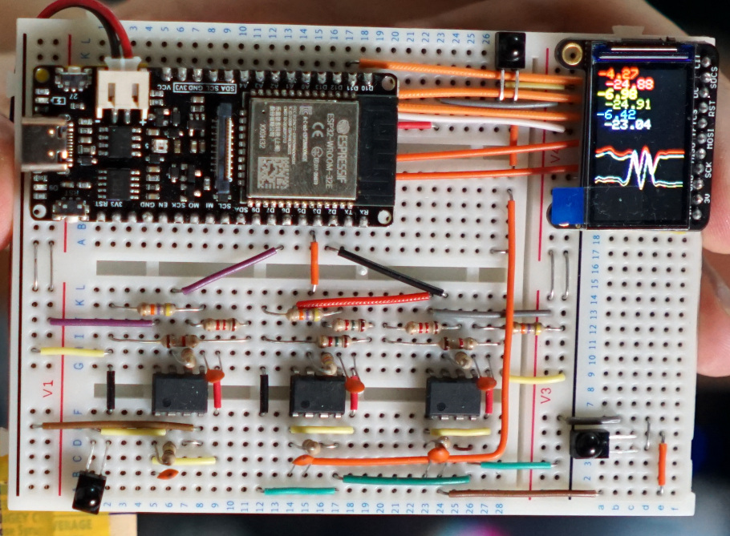

# lighthouse1
Simple Vive Base Station 1.0 tracking

## Introduction

The [vive-diy-position-sensor](https://github.com/ashtuchkin/vive-diy-position-sensor) project outlines a simple circuit utilising a [BPV22NF](https://uk.rs-online.com/web/p/photodiodes/1652447/) infrared photodiode and [TLV2462](https://uk.rs-online.com/web/p/op-amps/3568228/) op-amp that is sufficiently infrared sensitive to detect the infrared sync pulses and sweeps of an original Vive Base Station (version 1.0).

This project is aimed at creating an Arduino compatible code to utilise the vive-diy-position-sensor to locate in 3D space.

## Software overview

The code written in this repository is largely based on the following references:
* https://github.com/ashtuchkin/vive-diy-position-sensor
* https://github.com/nairol/LighthouseRedox/blob/master/docs/Light%20Emissions.md
* https://github.com/nairol/LighthouseRedox/blob/master/docs/Base%20Station.md

These describe the infrared signal timings of the base station sync and sweep, and how these encode information about which light house is broadcasting and which axis the following pulse is for.

The processing of sensor input occurs in code is a class structured into two halves. The first half of the code, `begin()` sets up an interrupt listening for activity on the sensor, triggering on rising and falling. At each fall, the duration and time of the pulse is stored in an array of the last several pulses. The second half of the code `processPulses()` classifies each pulse, to be called from the main loop. If the pulse is between 59 and 139 microseconds in duration, it is one of eight possible base station sync pulses, which indicates what base station emits the next pulse and what axis it's on. If the pulse is less than 15 microseconds in duration, it is a sweep pulse and its timing between 1222 and 6777 microseconds after the rising limb of the base station A sync pulse indicates the angle (scaled -60 to 60 degrees). Upon receiving a sweep pulse the angle of the appropriate axis is updated. (Note in the code nanosecond timings are used.)

### Current status

The code is currently tweaked for an ESP32, using tasks to spread out CPU load across both cores, but should fall back and work fine on other boards. An arbitrary number of sensors can be defined and for each sensor, the current x and y angle of the sensor relative to a single base station printed out, either over serial, HTTP, or a plain TCP connection. The last isn't setup for anything other than an ESP32.

The code still would not be happy with two base stations running. Nothing is being done to improve accuracy. Testing suggests that if the sensor is closer than about a meter to the lighthouse tracking is lost, we suspect this is the op-amp becoming swamped out. If the sensor is further than about 2.5 meters it does not appear to receive all sync pulses correctly. The code receives the first part of the data packet encoded by the lighthouse sweeps, identifying the start of the data (sometimes), but doesn't do interpret it.

### `#define`s

The code has several `#ifdef`s to detect a Teensy, ESP8266, or ESP32, with an else case for fallback code. You may want to check the fallback code if you're not using one of those three platforms. At the top of the main `ino` file you'll need to define the Sensors within an `#ifdef` block for these, as well as update the `#define NUM_SENSORS`.

There are five manual `#defines` in the code that turn on/off different features. `PRINT_OVER_SERIAL` will have the sensor angle readings printing out via `Serial.print()`. `PRINT_OVER_LCD` will plot a small graph on an [Adafruit 140x235 ST7789 LCD](https://shop.pimoroni.com/products/adafruit-1-14-240x135-color-tft-display-microsd-card-breakout-st7789) and display the current angle readings using the Adafruit GFX library. On an ESP8266 or ESP32, `USE_WIFI` can be used to enable connecting to a WiFi network. In that instance, `PRINT_OVER_HTTP` will enable an HTTP server that can be queried for the sensor angles. `PRINT_OVER_TCP` sets up listening on TCP port 81. Sending a one byte packet `Q` will return number of sensors * 2 floats for x1, y1, x2, etc.

For WiFi, you will need to create `wifidetails.h`, with `const char* ssid` and `const char* password` set to your access point's SSID and WPA pre-shared key.

### Turning angles into position

We're still working on a way to do this efficiently on the microcontroller. There's an iterative approach that runs fairly quickly we've developed based on minimising the distance between observed and predicted sensor locations, but this doesn't seem to scale well beyond three sensors, but with 3 sensors at least gives a rough idea of position. It appears you need at least 4 sensors, forming two different planes however, to fully localise with both position and attitude (pitch/yaw/roll). For four sensors we've started to look at things like matrix translations, as suggested by [Borges et al., 2018](https://ieeexplore.ieee.org/document/8593707). Their approach for [Astrobee](https://www.nasa.gov/astrobee) ([on GitHub](https://github.com/nasa/astrobee)) appears to be minimise the error between the observed and predicted sensor angles using a direct matrix transformation on a rigid body of the sensor positions. Unfortunately most existing work on this has been a bit difficult to follow, so we're aiming to develop something that can reasonably explained to makers without the use of advanced maths degrees.

## Notes on the circuit

The version of the circuit we have made uses the TLV2462CP instead of the TLV2462IP originally suggested, the only difference is commercial vs industrial operating temperature ratings. It also only uses a single photodiode, this has proven to be sufficiently sensitive for initial testing. To achieve 3k Ω resistance we used a 1.2k Ω resistor and a 1.8k Ω resistor in series. We are also operating it at 3.3 V logic levels rather than 5 V and haven't had any problems.

Current testing is being carried out with a [FireBeetle ESP32-E](https://wiki.dfrobot.com/FireBeetle_Board_ESP32_E_SKU_DFR0654) board. We were previously using a [Teensy 3.5](https://www.pjrc.com/store/teensy35.html), but the ability to go wireless with a tracking sensor is pretty useful. Testing with the two different microcontrollers suggests that any sufficiently fast microprocessor using the Arduino IDE should be compatible with the current code base. With some porting a the RP2040 should would also likely work.

With regards to circuit modifications, we believe there are a couple possible alternative op-amps that will work as well, the TSV912 and MCP6282. They are both a bit cheaper than the TLV2462. We think some of the sensor swamping out and distance values can be tweaked by adjusting the capacitance on the input of the first op-amp and the resistor ratio affecting gain on the second op-amp. This seems reasonable considering these other similar circuits:
* [Trammell Hudson](https://trmm.net/Lighthouse/) gives a similar lighthouse receiver circuit.
* [Analog Zoo](http://www.analogzoo.com/2016/08/photodiode-amplifier-design/) has designed a similar IR receiver circuit, providing a very good explanation for the circuit components.
* [solinvictus21](https://github.com/solinvictus21/Zippies/tree/master/LighthouseCircuit) also gives a similar lighthouse receiver circuit
All three have used a 2p2 uF capacitors to dampen the input op-amps tendency to oscillate (this explanation may be incorrect, apologies). The have gains that I think are like 220x, 68x, and 100x respectively, as opposed to the 16x currently used.

Version 2b:

Version 2:

Version 1:

